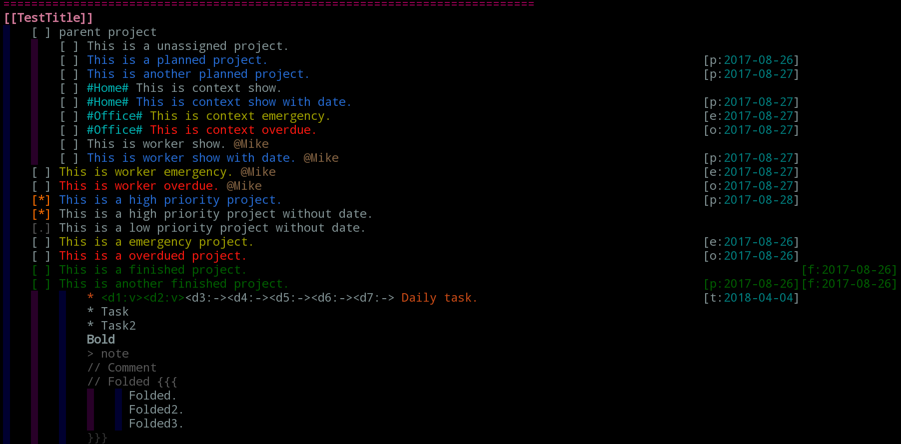
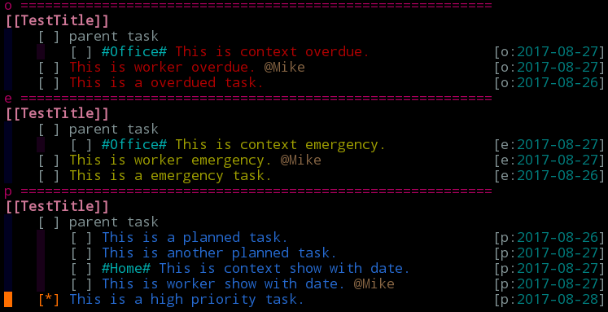

# vim-gtd

vim plugin which is designed by the concept of gtd.

## Overview

Overview:

Tasklist overview:

## Features

* Manage projects(subprojects) and task.
* Add planned (due) date and finished date(default today) by keyboard shortcuts, and can be seleted from calendar.
* Color highlight for planned / emergency / overdued TODOs.
* Specify workers by @Somebody mark.
* Specify context by #Somewhere# mark
* Support priorities for TODOs.
* Support repeated tasks.

## Usage

The easiest way to get started is playing around with the example file gtd/test/t.gtdt. And with key mapping:

    <leader>gp : Add gtd plan date.
    <leader>gf : Add gtd finish date.
    <leader>gc : Check if any task is overdue.
    <leader>gt : Show the planned tasks in a splited window, with emergency and overdued task included.
    <tab>      : Switch folding status(between zO and zC).

## Config

In vimrc, set:

    let g:gtd_gtdfiles = ["~/my.gtd", "~/my2.gtd"]
        Set the gtd file list so you can open them all by command :Gtdo
        default: ["~/.my_vimgtd.gtd"]
    let g:gtd_auto_check_overdue = 0
        If set to 1, then the plugin will check if task overdue automatically
        when opening gtd file.
        default: 0
    let g:gtd_check_overdue_auto_save = 0
        If set to 1, then gtd file will automatically be saved after check-overdue.
        default: 0
    let g:task_list_with_parents = 1
        If set to 1, then task list would show with its parents.
        If set to 0, then task list would only show the task itself.
        default: 1
    let g:gtd_emergency_days = 7
        Set the days that would considered as emergency if the interval
        from today to the planned date is less than this value.
        default: 7

